# Folio

<p align="center">
  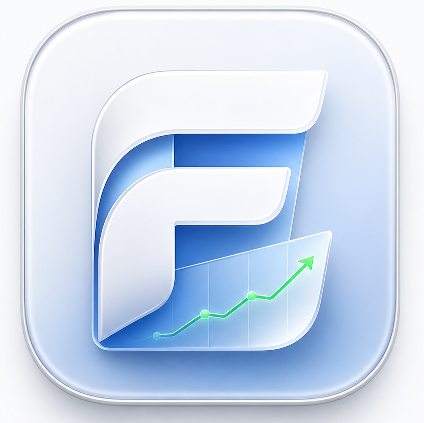
</p>

<p align="center">
  <a href="README.en.md">English</a> · <a href="README.md">简体中文</a>
</p>

<p align="center">
  <strong>Local-first AI-native investment research workbench</strong><br />
  Research the market, understand your exposure, and keep an evidence-backed view of what changed.
</p>

<p align="center">
  <a href="https://github.com/helsome/folio/releases">Releases</a> ·
  <a href="docs/architecture.md">Architecture</a> ·
  <a href="docs/PRD.md">Product requirements</a>
</p>

> Follow the whole research loop: **What happened? → Why does it matter to your portfolio? → What did you believe before? → What changed?**

[Overview](#overview) · [App screenshots](#app-screenshots) · [Features](#key-features) · [How it works](#how-it-works) · [Quick start](#quick-start) · [Repository map](#repository-map) · [Documentation](#documentation)

## Overview

Folio is a desktop research environment for public-market investors. It combines a quiet finance workspace with an agent copilot that can fetch structured market data, explain the evidence, and carry research forward into theses, alerts, and portfolio decisions.

Folio is local-first: sessions, credentials, and research state stay on the device by default. Online models, market-data providers, and optional tracing services still receive the requests sent to them; local-first does not mean every workflow is offline.

> Folio is a research and decision-support tool. It is read-only by design and does not expose order or trading capabilities.

### Find your starting point

| Your question | Start here | What you get |
| --- | --- | --- |
| What needs attention today? | Today / Events | Portfolio attention items, watchlist moves, events, and research entry points |
| What is happening with this company? | Workspace / Copilot | Quotes, charts, financials, news, and context-aware questions |
| What supports a decision? | Research / Compare | Evidence-linked reports with explicit gaps, plus multi-symbol comparisons |
| How has my view changed? | Thesis / Alerts | Editable theses, alert rules, re-evaluation, and research diffs |
| Is the workspace ready? | Settings / Skills / Evaluation | Provider connections, capability readiness, evaluation, and tracing |

**Suggested first session:** browse Today → choose a symbol → inspect its workspace → run Deep Research → check the evidence → save a thesis → follow changes with alerts and re-evaluation.

## App Screenshots

These are **real Electron app captures** already committed to this repository. They were captured on 2026-08-28 with `e2e/visual.mjs`, the local agent, and demo data; see the [source commit](https://github.com/helsome/folio/commit/bc076da9a94d014076e02fd0a0dbcae3a3e01851). They show the UI and states at that time, not live prices, a real account, or a fresh verification of the current build. The [screenshot inventory](docs/screenshots/README.md) describes each state.

### Today: start with what needs attention

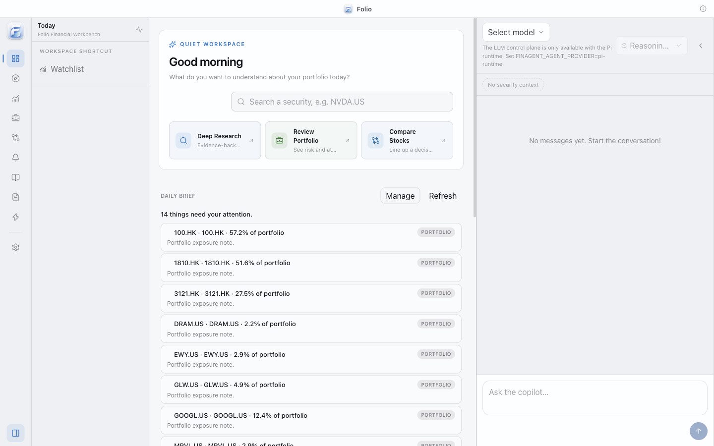

### Portfolio and events: bring information into your research context

| Portfolio | Events & Catalysts |
| --- | --- |
| 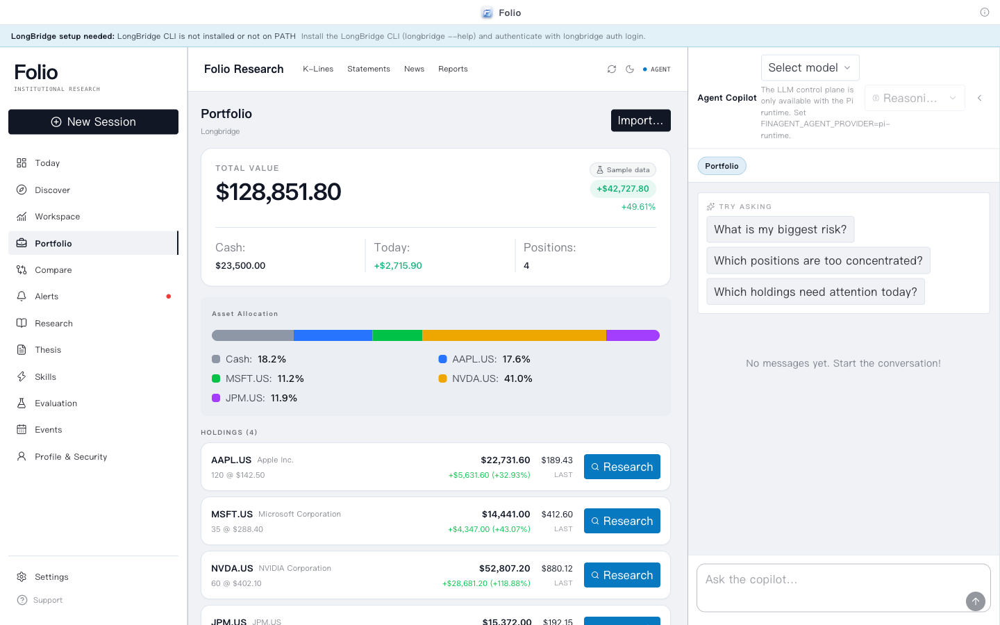 | 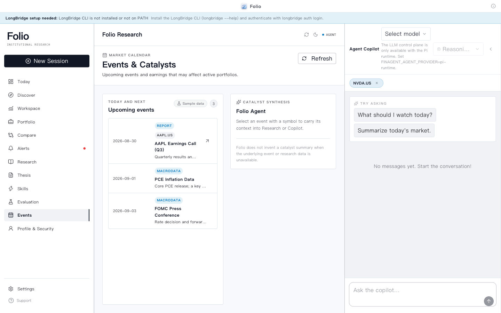 |
| Sample holdings, allocation, and research entry points | Sample earnings, macro, and central-bank events with research context |

<details>
<summary>More screens: workspace, discovery, skills, settings, evaluation, and health</summary>

| Workspace | Discover |
| --- | --- |
| 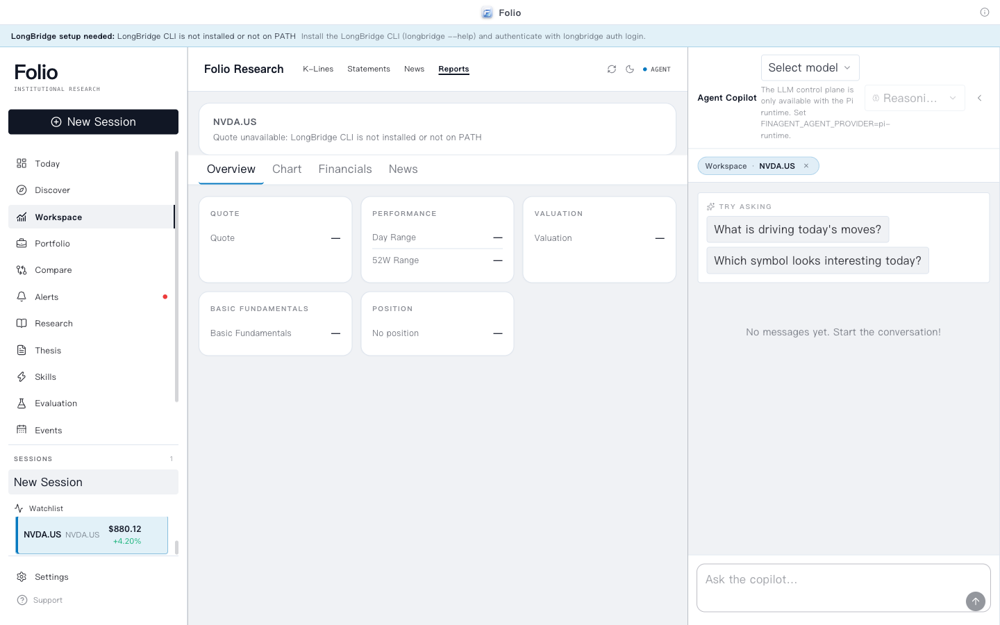 | 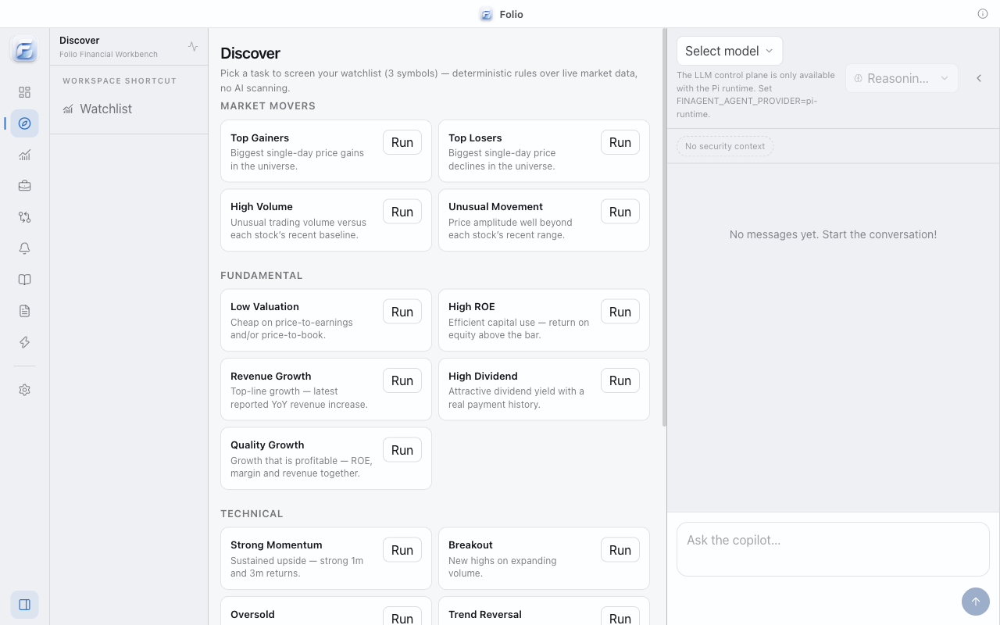 |
| Missing values remain visible without a market-data connection | Task selection, not completed screening results |

| Skills | Settings |
| --- | --- |
| 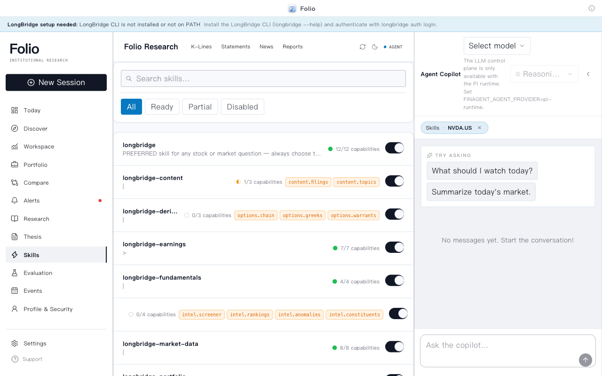 | 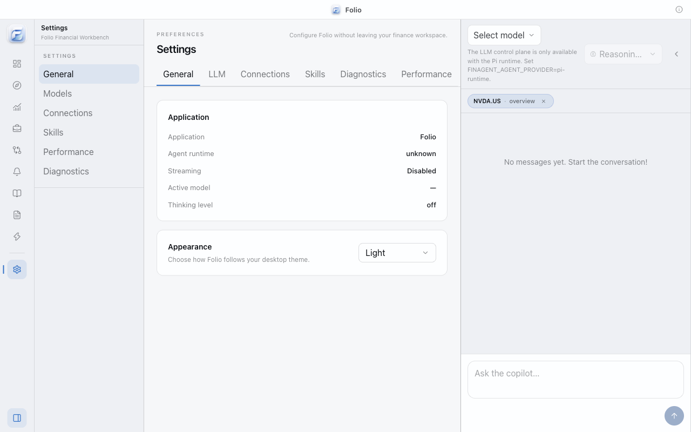 |

| Evaluation | Local workspace health |
| --- | --- |
| 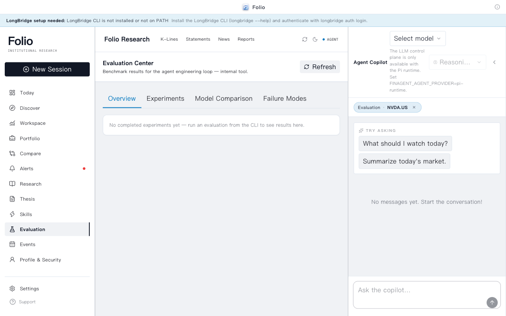 | 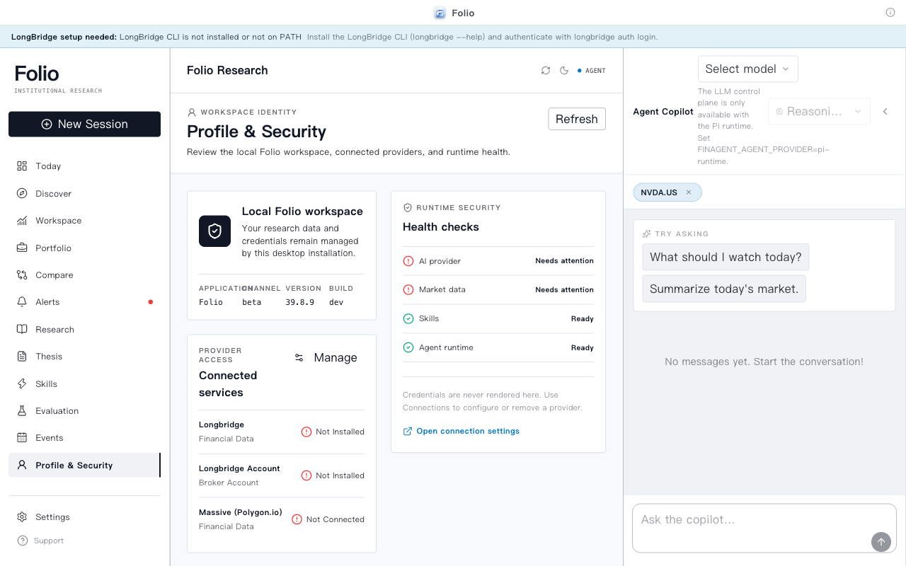 |

</details>

Sample values carry a `Sample data / 示例数据` badge. Unavailable data, unconfigured services, and empty evaluation results remain visible too; not every screen has sample data.

## Key Features

### Research Workspace

- Watchlists, quotes, K-line charts, financial statements, news, and security overviews.
- A three-pane desktop layout: navigation, market workspace, and Agent copilot, with persistent asset tabs (K-Lines / Statements / News / Reports) in the workspace topbar.
- Compare 2–4 symbols across valuation, growth, margins, ROE, dividends, returns, ratings, and momentum.
- Data freshness is visible; missing values render as `—` instead of being guessed.

### Built-in Sample Data (offline fallback)

- With no market-data provider or LLM connected, Today, the portfolio card, Market Pulse, events, and the daily brief render built-in sample data — the workspace is complete from the very first launch.
- Every sample surface carries a visible “Sample data” badge (with a tooltip explaining how to connect real sources); error details stay in the underlying state, and live data replaces samples the moment it becomes available.
- Symbols outside the sample set (e.g. `0700.HK`) keep their honest empty/error states — nothing is fabricated.

### Deep Research

- One-click research from a focused security.
- Parallel capability fetches with bounded concurrency, timeouts, cancellation, and honest partial-failure states.
- Durable checkpoints preserve completed steps. Interrupted runs can be resumed, restarted, or discarded; resuming requires the original provider, model, and configuration. See [research recovery](docs/research-recovery.md).
- Structured data bundle → agent synthesis → evidence-backed `ResearchReport`.
- Reports contain stance, confidence, sections, bull case, bear case, catalysts, risks, and links back to the capability run behind each claim.

### Agent Copilot

- Persistent sessions and streamed answers powered by the Pi Agent runtime.
- Model and thinking-level controls, stop/cancel, workspace context, and structured quote/portfolio cards.
- Markdown answers render with headings, lists, tables, links, and code blocks.
- Internal synthesis sessions stay out of the visible conversation history.

### Agent Evaluation & Observability

- An integrated Evaluation Center for experiments, baselines, model comparisons, failure modes, case details, and human feedback.
- Coverage includes task completion, tool selection and arguments, evidence/provenance, latency, failure recovery, research completeness, and decision usefulness.
- Supports local offline evaluation and optional LangSmith / Langfuse tracing; tracing is off by default, with privacy level and API-key controls in Settings.
- The `folio-agent-v1` benchmark contains 86 golden, difficult, long-tail, tool-failure, regression, and adversarial cases; fixed bugs become regression gates.
- Deterministic fixture smoke evaluation can be run manually. The current `Eval Smoke` workflow is manual-only and does not run automatically on pull requests; full benchmarks and model/strategy experiments run separately.

### Skills & Capability Layer

- A single capability registry powers provider execution, agent tools, UI availability, and skill readiness.
- Skills declare required and optional capabilities; the Skills Center shows Ready, Partial, and Disabled states.
- Progressive loading keeps skill instructions and reference material available without putting every document into every prompt.
- The agent never claims a missing capability is available.

### Discover & Learning Loop

- 17 deterministic screening tasks across market movers, fundamentals, technicals, and events.
- Eight research strategies: Comprehensive, Value, Growth, Technical, Earnings, Event Driven, Risk Review, and Income.
- Candidate actions flow into Research, Compare, and Watchlist with evidence and reasons attached.
- Research Diff highlights changed verdicts, valuation moves, new risks, and confidence deltas.

### Portfolio, Thesis & Monitoring

- Portfolio allocation, concentration, Herfindahl, large-position, earnings, news, drawdown, and exposure signals.
- Save a report as an editable investment thesis and re-evaluate it against fresh data.
- Alert rules for price, news, earnings, ratings, dividends, position weight, and drawdown.
- Today combines portfolio attention items, watchlist movers, alerts, upcoming events, recent research, and theses needing review.
- A dedicated **Events & Catalysts page**: earnings, macro releases, and central-bank calendar events, with one-click context handoff into Research.
- A **Profile page** with at-a-glance local workspace health (AI / market data / skills / agent runtime).

## How It Works

### System overview

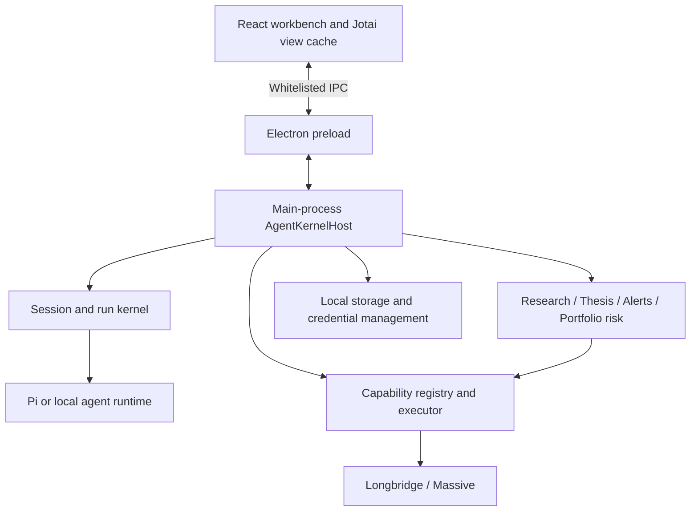

The renderer handles interaction and presentation. The main process owns sessions, research state, credentials, and external access. Providers return normalized data with provenance; product workflows consume typed capability contracts. See the [architecture guide](docs/architecture.md).

### From a research request to a report

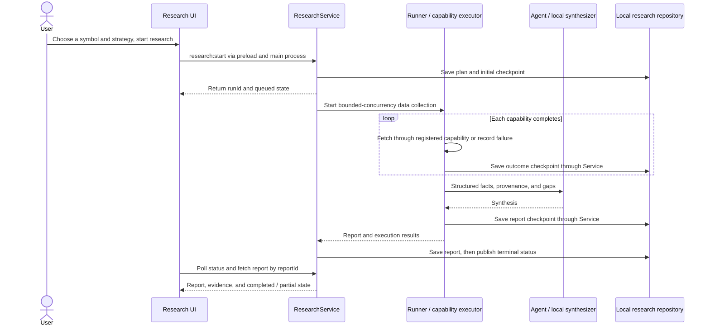

This is the simplified report-producing path. Missing or failed capabilities remain visible in the report; cancellation, failure, and interruption have separate states. Recovery reuses saved outcomes instead of repeating completed fetches. Source entry points: [Service](packages/shared/src/research/service.ts), [Runner](packages/shared/src/research/runner.ts), and [UI state](packages/ui/src/atoms/researchAtoms.ts).

## Flexible Integrations

- **Market data:** Longbridge is the primary connector for US/HK/CN market data and brokerage portfolio access; Massive is available as a secondary US market-data provider.
- **Agent runtime:** Pi runtime for configured LLM providers, with a deterministic local provider for development and offline golden paths.
- **Desktop:** Electron with a macOS arm64 packaged build. The renderer, preload bridge, and main-process kernel are separated by context isolation and a whitelisted IPC surface.
- **Skills:** Vendored `SKILL.md` resources with references, enable/disable state, triggers, and capability requirements.
- **Agent evaluation:** Local, LangSmith-backed, or Langfuse-backed evaluation records traces, datasets, evaluators, experiments, and regression gates; engineering metrics can be linked to investment outcomes without claiming causation.

## Quick Start

### For Users

Download the latest macOS build from the [Releases page](https://github.com/helsome/folio/releases). After launching Folio:

1. The full workspace is browsable on first launch — built-in sample data (badged “Sample data”) is shown until services are connected.
2. Configure an LLM provider in **Settings → Models**, or use the local provider for a deterministic demo.
3. Connect Longbridge in **Settings → Connections** for live market data and portfolio access; sample data switches to live data automatically.
4. Select a symbol from the Watchlist and open **Deep Research**.

Longbridge authentication can also be completed from the terminal:

```bash
longbridge auth login
```

### For Developers

Prerequisites: [Bun](https://bun.sh) (PR CI pins `1.4.2`) and Git. Live market data requires a separately installed and authenticated [Longbridge CLI](https://open.longbridge.com/longbridge/longbridge-terminal/install); the Pi runtime needs a configured LLM provider. The local demo does not require an external LLM.

> **Windows**: When developing from a standard (non-administrator) terminal, enable Developer Mode first (Settings → System → For developers). Otherwise, installing this project's workspace/symlink dependencies with Bun may leave empty directories under `node_modules`, omit `.bin`, or fail with `tsc not found`. Processes with the required symlink privilege or elevated permissions are not affected.

```bash
# Clone and install
git clone https://github.com/helsome/folio.git
cd folio
bun install

# Build the renderer, preload, and main process
bun run build

# Terminal 1: start the renderer dev server and leave it running
bun run dev
```

In a second terminal, launch Electron from the repository root:

```bash
# Local agent plus sample-data fallback; sample Copilot answers are labeled
FINAGENT_AGENT_PROVIDER=local FINAGENT_DEMO_DATA=1 bun --cwd apps/electron x electron .
```

`bun run dev` starts Vite only; it does not launch an Electron window. Opening the renderer in a browser also lacks main-process IPC. Set the environment variables on the Electron process. To use an online model, exit the local demo, relaunch Electron without the two demo variables, and then configure the model in Settings; the local agent does not expose the model control plane. Rebuild and restart Electron after main-process or preload changes. The environment-variable syntax above is for POSIX shells; in PowerShell use `$env:NAME="value"`.

### Commands

| Command | Description |
| --- | --- |
| `bun run dev` | Start the Electron renderer in development mode |
| `bun run test:unit` | Run the full unit and integration suite with isolation |
| `bun run typecheck` | Typecheck every workspace package |
| `bun run build` | Build packages, renderer, preload, and main process |
| `bun run test:e2e` | Run the Electron golden-path E2E suite |
| `bun run --cwd apps/electron test:typed-blocks` | Run the real-app typed answer blocks Copilot E2E (apps/electron) |
| `bun run eval:smoke` | Manually run the deterministic Agent smoke eval |
| `bun run eval:full` | Run the full Agent benchmark and experiment flow |
| `bun run release:check` | Run the release gates |
| `bun run release:package` | Build the macOS arm64 app, DMG, and SHA256 checksums |

The packaged artifacts are staged in `dist/release/`.

## Security & Product Boundaries

- Electron runs with `contextIsolation: true`, `nodeIntegration: false`, and a whitelisted preload bridge.
- API keys and custom provider credentials are encrypted at rest with Electron `safeStorage` in the main process.
- Longbridge commands use argv-safe execution, symbol validation, and read-only capability registration.
- Skill resources are path-safe: traversal and symlink escapes are rejected.
- Research reports distinguish unavailable data from negative evidence and never fabricate missing numbers.
- Agent tracing is off by default; standard privacy redacts prompts, answers, arguments, and portfolio tool results, while full tracing requires explicit opt-in.
- Unsigned local builds may trigger a macOS security prompt; see the [release gates](docs/release-gates.md) for signing and notarization requirements.

## Project Status

Folio is in beta. The current repository includes the V5 research, discovery, monitoring, outcome, and adaptive-calibration surfaces, plus a refreshed visual system implementing the Stitch “Minimalist Personal Portfolio” design language: a redrawn sidebar and workspace topbar, new Events & Catalysts and Profile pages, a unified component library and radius scale, and the offline sample-data fallback.

Agent engineering evaluation is wired into Settings and the Evaluation Center: LangSmith / Langfuse connections, privacy controls, benchmark experiments, failure-mode analysis, case-level traces, and human feedback are available as advanced workflows. Research runs also support durable checkpoints and interruption recovery.

- See the commands above for validation; use the test report and [Actions](https://github.com/helsome/folio/actions) for the specific commit rather than a fixed passing-test count
- PR checks skip Markdown / `docs/**` / `artifacts/**`-only changes; absent checks do not mean tests passed
- Electron E2E and packaged smoke gates: available through the release scripts
- Current package channel: `0.4.0-beta.2`

Known limitations and release decisions are documented in [`docs/release-gates.md`](docs/release-gates.md) ([简体中文](docs/release-gates.zh-CN.md)) and [`docs/provider-b-decision.md`](docs/provider-b-decision.md) ([简体中文](docs/provider-b-decision.zh-CN.md)).

## Roadmap

### Near Term

- More provider coverage behind the same capability contracts.
- Better report navigation and evidence inspection.
- Valuation comparison table (CURRENT vs 5Y AVG) and target-price cards for the security workspace (see [`docs/design-comparison.md`](docs/design-comparison.md)).
- More useful portfolio-aware research prompts without leaking internal runtime instructions into the user conversation.

### Longer Term

- Cross-platform packaged builds.
- More research strategies and outcome calibration samples.
- Richer scheduled briefs, notification channels, and user-defined monitoring rules.
- A contributor-friendly skill and provider extension model.

## Repository Map

| Directory | Responsibility |
| --- | --- |
| [`apps/electron`](apps/electron) | Electron main process, IPC, preload, renderer entry, and E2E |
| [`packages/ui`](packages/ui) | React views, components, Jotai state, and sample data |
| [`packages/core`](packages/core) | Domain contracts for capabilities, research, portfolios, events, and traces |
| [`packages/shared`](packages/shared) | Agent kernel, providers, research workflows, and local storage |
| [`packages/longbridge-tools`](packages/longbridge-tools) | Longbridge CLI execution, validation, and normalization |
| [`packages/pi-extension`](packages/pi-extension) / [`.pi/extensions`](.pi/extensions) | Agent tools and Pi runtime extensions |
| [`packages/skill-hub`](packages/skill-hub) / [`skills`](skills) | Skill discovery, capability requirements, and bundled resources |
| [`packages/i18n`](packages/i18n) | English and Chinese UI localization |
| [`scripts/eval`](scripts/eval) / [`docs`](docs) | Evaluation entry points, validation notes, and design documentation |

## Documentation

- [`docs/architecture.md`](docs/architecture.md) — system architecture and runtime boundaries · [简体中文](docs/architecture.zh-CN.md)
- [`docs/PRD.md`](docs/PRD.md) — product requirements and invariants (document is in Chinese)
- [`docs/UI-SYSTEM.md`](docs/UI-SYSTEM.md) — visual system and component rules · [简体中文](docs/UI-SYSTEM.zh-CN.md)
- [`docs/longbridge-auth.md`](docs/longbridge-auth.md) — Longbridge authentication · [简体中文](docs/longbridge-auth.zh-CN.md)
- [`docs/longbridge-skill-setup.md`](docs/longbridge-skill-setup.md) — skill setup and capability coverage · [简体中文](docs/longbridge-skill-setup.zh-CN.md)
- [`docs/release-gates.md`](docs/release-gates.md) — release validation checklist · [简体中文](docs/release-gates.zh-CN.md)
- [`docs/EVALUATION.md`](docs/EVALUATION.md) — Agent evaluation, LangSmith observability, and experiment architecture · [CI strategy](docs/EVALUATION-CI.md) · [benchmark](docs/EVALUATION-BENCHMARK.md)
- [`docs/research-recovery.md`](docs/research-recovery.md) — research checkpoints, interruption recovery, and verification
- [`docs/langfuse-tracing.md`](docs/langfuse-tracing.md) — Langfuse tracing for Copilot and Deep Research · [简体中文](docs/langfuse-tracing.zh-CN.md)
- [`docs/screenshots/README.md`](docs/screenshots/README.md) — screenshot sources, dates, and data states
- [`docs/design-comparison.md`](docs/design-comparison.md) — screen-by-screen comparison between the Stitch designs and the current implementation

## Contributing

Issues and pull requests are welcome. Read the [contribution guide](CONTRIBUTING.md), run checks relevant to your change, and include the environment, exact commands, results, and known limitations. Full validation entry points:

```bash
bun test
bun run typecheck
```

For visible UI changes, include an after screenshot and a before/after comparison when applicable. Otherwise, state that the PR has no visible UI changes.
