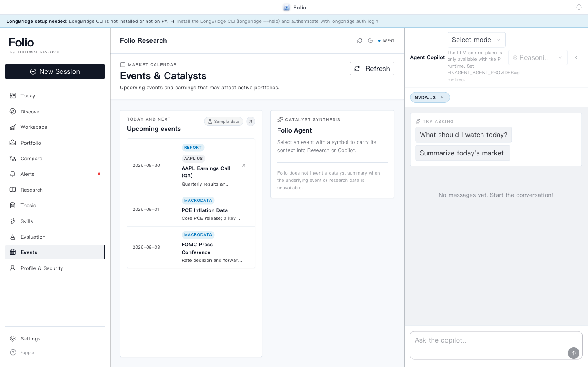
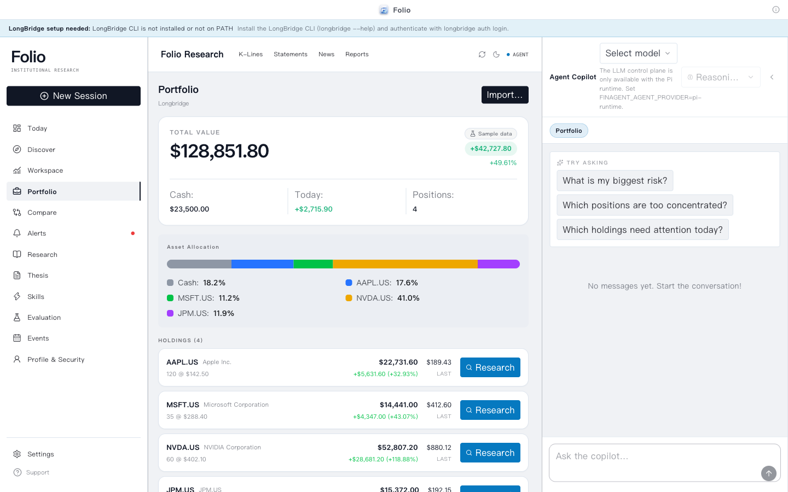
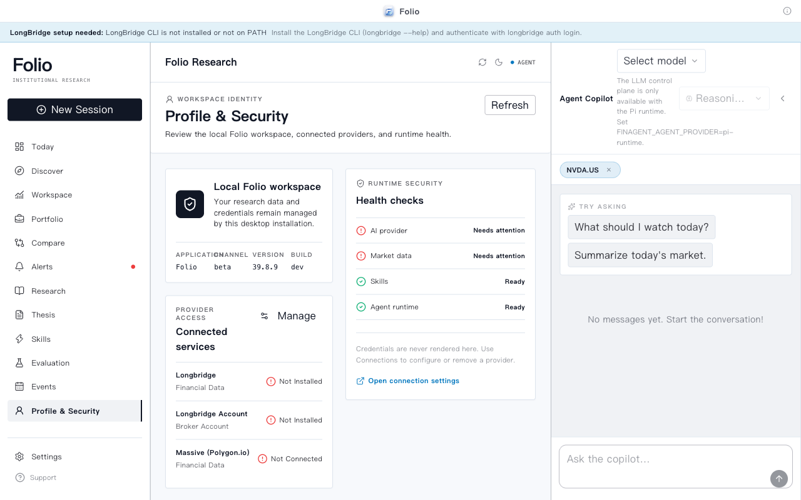
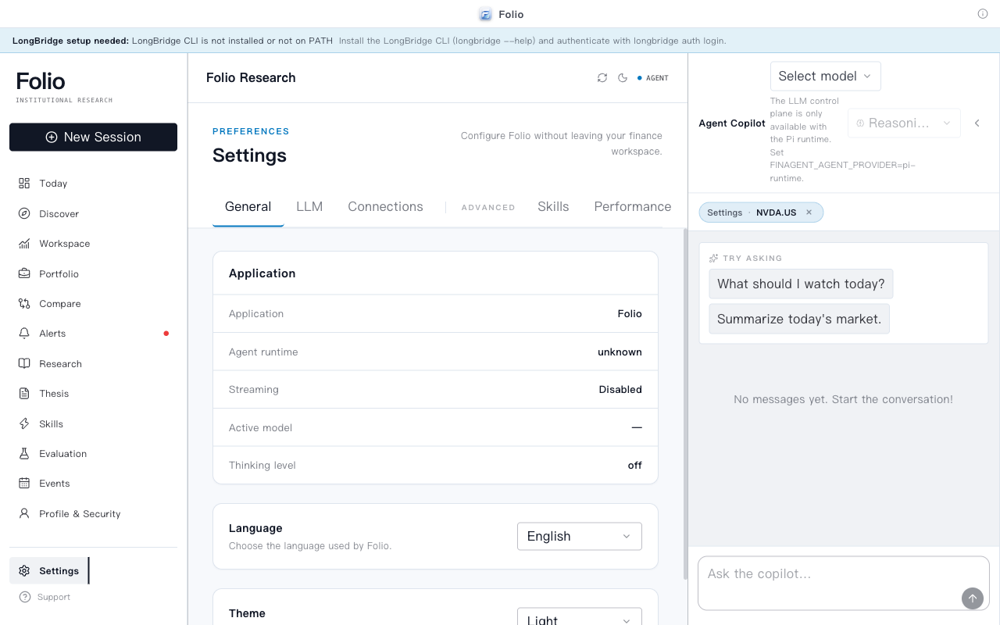
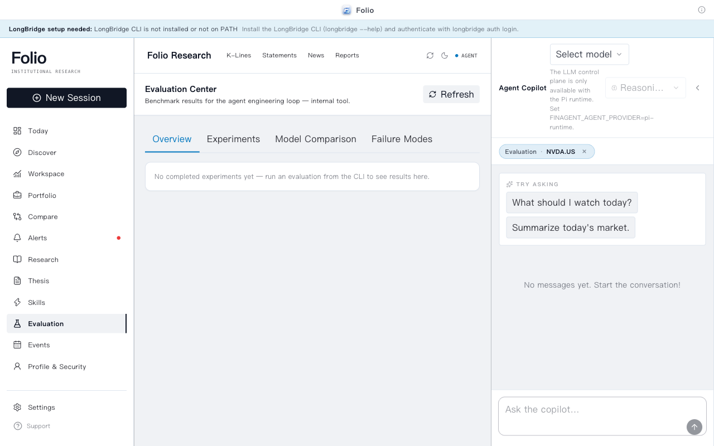
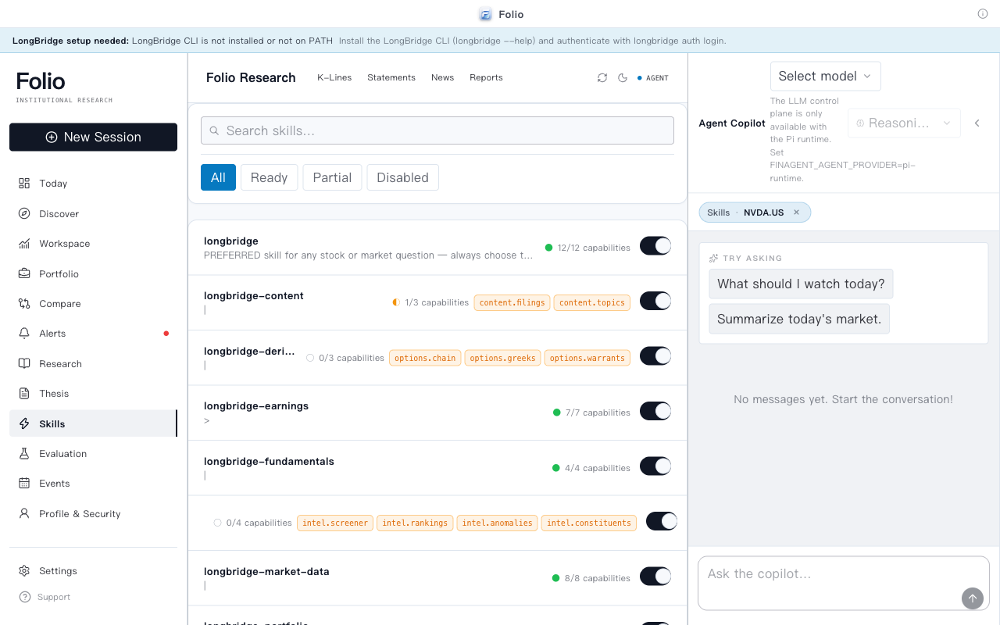

# Folio

<p align="center">
  
</p>

<p align="center">
  <a href="README.en.md">English</a> · <a href="README.md">简体中文</a>
</p>

<p align="center">
  <strong>本地优先的 AI 原生投资研究工作台</strong><br />
  研究市场、理解你的敞口，并持续保有基于证据的判断——清楚看到什么发生了变化。
</p>

<p align="center">
  <a href="https://github.com/helsome/folio/releases">发布版本</a> ·
  <a href="docs/architecture.zh-CN.md">系统架构</a> ·
  <a href="docs/PRD.md">产品需求</a>
</p>

> 一句话：行情终端告诉你 **What happened**；Folio 的 Agent 帮你回答 **Why does this matter to you**，记录 **What did you believe before**，并持续追踪 **What changed**。

## 我们的产品

Folio 是为公开市场投资者打造的桌面研究环境。它将安静整洁的金融工作区与 Agent 副驾驶（copilot）相结合——Agent 可以获取结构化的行情数据、解释证据，并将研究持续推进到投资论点、提醒与投资组合决策中。

Folio 本地优先：会话、凭证与研究状态默认保存在设备本地。行情数据与模型提供商是明确的集成项，而非隐藏的依赖。

> Folio 是研究与决策支持工具，设计上只读，不提供下单或交易能力。

## 截图

<p align="center">
  
</p>

<p align="center">
  <em>Today——投资组合关注事项、市场脉搏、事件与快速研究操作。</em>
</p>

<p align="center">
  
  
</p>

<p align="center">
  
  
</p>

<p align="center">
  
  
</p>

<p align="center">
  
  
</p>

<p align="center">
  <em>从证券工作区、事件与催化、组合总览，到设置中心、技能状态与评测追踪——未接入任何服务时，以上页面均以内置示例数据（带“示例数据”徽标）完整呈现。</em>
</p>

## 核心功能

### 研究工作区

- 自选清单、行情、K 线图、财务报表、新闻与证券概览。
- 三栏桌面布局：导航、市场工作区与 Agent 副驾驶；顶部常驻资产页签（K 线 / 报表 / 新闻 / 报告），任何页面都能一键切换视角。
- 在估值、成长性、利润率、ROE、股息、回报、评级与动量等维度对比 2–4 只标的。
- 数据新鲜度可见；缺失值显示为 `—`，不会凭空猜测。

### 开箱即用的示例数据（离线回退）

- 未接入行情提供商或 LLM 时，Today、组合总览、市场脉搏、事件与每日简报自动展示内置示例数据，应用从第一次启动起就是完整的。
- 所有示例内容都带有醒目的“示例数据”徽标（含接入指引 tooltip），错误信息保留在底层状态中，真实数据一旦可用立即覆盖示例。
- 不在示例集内的代码（如 `0700.HK`）保持诚实的空态/错误态，绝不编造数据。

### 深度研究

- 从聚焦的证券一键发起研究。
- 并行能力调用：有界并发、超时、取消与诚实的部分失败状态。
- 结构化数据包 → Agent 综合 → 基于证据的 `ResearchReport`。
- 报告包含立场、置信度、章节、看多论点、看空论点、催化剂、风险，以及每条论断背后对应能力执行记录的链接。

### Agent 副驾驶

- 由 Pi Agent 运行时驱动的持久会话与流式回答。
- 模型与思考级别控制、停止/取消、工作区上下文，以及结构化的行情/投资组合卡片。
- Markdown 回答支持标题、列表、表格、链接与代码块。
- 内部综合会话不会出现在可见的对话历史中。

### Agent 评测与可观测性

- 内置 Evaluation Center：查看实验、基线、模型对比、失败模式、案例详情与人工反馈。
- 评测覆盖任务完成、工具选择与参数、证据/来源、时延、失败恢复、研究完整性与决策可用性。
- 支持本地离线评测与可选 LangSmith 追踪；追踪默认关闭，隐私级别与 API 密钥在设置中单独管理。
- `folio-agent-v1` 基准集包含 86 个黄金路径、困难、长尾、工具失败、回归与对抗案例；固定 bug 会沉淀为回归门槛。
- PR 使用零成本、确定性的 smoke eval，完整 benchmark 与模型/策略实验按需或定时运行。

### 技能与能力层

- 单一能力注册表驱动提供商执行、Agent 工具、UI 可用性与技能就绪状态。
- 技能声明所需与可选能力；技能中心展示就绪、部分就绪与已禁用状态。
- 渐进式加载让技能指令与参考资料随时可用，而无需把每份文档都塞进每个提示词。
- Agent 绝不会声称某个缺失的能力可用。

### 发现与学习循环

- 覆盖市场异动、基本面、技术面与事件的 17 个确定性筛选任务。
- 八种研究策略：综合、价值、成长、技术、财报、事件驱动、风险复盘与收益。
- 候选操作连同证据与理由流入研究、对比与自选清单。
- 研究差异对比（Research Diff）突出显示结论变化、估值变动、新风险与置信度变化。

### 投资组合、论点与监控

- 投资组合配置、集中度、赫芬达尔指数、大额持仓、财报、新闻、回撤与敞口信号。
- 将报告保存为可编辑的投资论点，并基于新数据重新评估。
- 针对价格、新闻、财报、评级、股息、持仓权重与回撤的提醒规则。
- Today 整合投资组合关注事项、自选异动、提醒、即将到来的事件、近期研究与待复审的论点。
- 独立的 **Events & Catalysts 页面**：财报、宏观数据与央行日历，一键带上下文跳转研究。
- **个人资料页**：本地工作区健康检查（AI / 行情 / 技能 / Agent 运行时）一目了然。

## 工作原理

```text
Longbridge / Massive 提供商
              │
              ▼
     能力注册表（Capability Registry）
              │
       ┌──────┼───────────────┐
       ▼      ▼               ▼
    Agent   研究            产品 UI
    工具   + 论点           + 技能
           + 提醒           + 对比
           + 风险           + Today
              │
              ▼
      基于证据的报告
```

核心边界刻意保持很小：提供商返回带来源（provenance）的规范化数据，能力暴露类型化操作，产品工作流消费这些契约，而不是导入厂商专属代码。

## 灵活集成

- **行情数据：** Longbridge 是美股/港股/内地市场数据与券商投资组合访问的主要连接器；Massive 是美股市场的备选数据提供商。
- **Agent 运行时：** 为已配置的 LLM 提供商提供 Pi 运行时，另有用于开发与离线黄金路径的确定性本地提供商。
- **桌面端：** Electron，含 macOS arm64 打包构建。渲染进程、预加载桥与主进程内核通过上下文隔离与白名单化 IPC 接口面分离。
- **技能：** 内置 `SKILL.md` 资源，含引用、启用/禁用状态、触发器与能力要求。
- **Agent 评测：** 通过本地 Evaluation Backend 或 LangSmith 记录 trace、dataset、evaluator、experiment 与 regression gate；工程指标与投资结果保持可链接但不宣称因果关系。

## 快速开始

### 面向用户

从[发布页面](https://github.com/helsome/folio/releases)下载最新的 macOS 构建。启动 Folio 后：

1. 首次启动即可浏览完整工作台——未接入服务前展示内置示例数据（带“示例数据”徽标）。
2. 在 **设置 → 模型** 中配置 LLM 提供商，或使用本地提供商进行确定性演示。
3. 如需实时行情数据与投资组合访问，在 **设置 → 连接** 中连接 Longbridge；连接后示例数据自动切换为真实数据。
4. 从自选清单中选择标的，打开**深度研究**。

Longbridge 认证也可以在终端完成：

```bash
longbridge auth login
```

### 面向开发者

前置条件：[Bun](https://bun.sh)、用于实时数据的 [Longbridge CLI](https://open.longbridge.com/longbridge/longbridge-terminal/install)，以及用于 Pi 运行时的 LLM 提供商。

```bash
# 克隆并安装
git clone https://github.com/helsome/folio.git
cd folio
bun install

# 以开发模式运行桌面应用
bun run dev

# 确定性本地 Agent 路径——无需外部 LLM
FINAGENT_AGENT_PROVIDER=local bun run dev
```

### 命令

| 命令 | 说明 |
| --- | --- |
| `bun run dev` | 以开发模式启动 Electron 渲染进程 |
| `bun test` | 运行完整单元与集成测试套件 |
| `bun run typecheck` | 对所有工作区包执行类型检查 |
| `bun run build` | 构建包、渲染进程、预加载与主进程 |
| `bun run test:e2e` | 运行 Electron 黄金路径 E2E 套件 |
| `bun run eval:smoke` | 运行 PR 级确定性 Agent 回归评测 |
| `bun run eval:full` | 运行完整 Agent benchmark 与实验流程 |
| `bun run release:check` | 运行发布门槛检查 |
| `bun run release:package` | 构建 macOS arm64 应用、DMG 与 SHA256 校验和 |

打包产物暂存于 `dist/release/`。

## 安全与产品边界

- Electron 以 `contextIsolation: true`、`nodeIntegration: false` 运行，并采用白名单化预加载桥。
- API 密钥与自定义提供商凭证在主进程中使用 Electron `safeStorage` 加密存储。
- Longbridge 命令使用 argv 安全执行、标的校验与只读能力注册。
- 技能资源路径安全：拒绝路径穿越与符号链接逃逸。
- 研究报告区分“数据不可用”与“负面证据”，绝不编造缺失的数字。
- Agent 追踪默认关闭；标准隐私级别会脱敏 prompt、答案、参数与组合工具结果，完整追踪必须显式启用。
- 未签名的本地构建可能触发 macOS 安全提示；签名与公证是发布阶段的可选步骤。

## 项目状态

Folio 处于测试版（beta）。当前仓库包含 V5 研究、发现、监控、结果与自适应校准相关功能面，以及落地 Stitch「Minimalist Personal Portfolio」设计语言的全新视觉系统：重绘的侧栏与顶部工作区栏、Events & Catalysts 与个人资料页面、统一的组件库与圆角阶梯，以及离线示例数据回退。

Agent 工程评测（V7）已接入设置与评测中心：支持 LangSmith 连接、隐私控制、基准实验、失败模式分析、案例级 trace 与人工反馈。

- 单元与集成测试：**1157+ 项通过**
- 类型检查：**通过**
- Electron E2E 与打包冒烟门槛：可通过发布脚本运行
- 当前包通道：`0.4.0-beta.2`

已知限制与发布决策记录在 [`docs/release-gates.zh-CN.md`](docs/release-gates.zh-CN.md)（[英文原文](docs/release-gates.md)）与 [`docs/provider-b-decision.zh-CN.md`](docs/provider-b-decision.zh-CN.md)（[英文原文](docs/provider-b-decision.md)）。

## 路线图

### 近期

- 在同一能力契约下覆盖更多提供商。
- 更好的报告导航与证据检视。
- 证券工作台的估值对比表（CURRENT vs 5Y AVG）与目标价卡片（见 [`docs/design-comparison.md`](docs/design-comparison.md)）。
- 更有用的组合感知研究提示，同时不把内部运行时指令泄漏进用户对话。

### 长期

- 跨平台打包构建。
- 更多研究策略与结果校准样本。
- 更丰富的定时简报、通知渠道与用户自定义监控规则。
- 便于贡献者使用的技能与提供商扩展模型。

## 文档

- [`docs/architecture.zh-CN.md`](docs/architecture.zh-CN.md) — 系统架构与运行时边界 · [English](docs/architecture.md)
- [`docs/PRD.md`](docs/PRD.md) — 产品需求与不变式（本文档为中文）
- [`docs/UI-SYSTEM.zh-CN.md`](docs/UI-SYSTEM.zh-CN.md) — 视觉系统与组件规则 · [English](docs/UI-SYSTEM.md)
- [`docs/longbridge-auth.zh-CN.md`](docs/longbridge-auth.zh-CN.md) — Longbridge 认证 · [English](docs/longbridge-auth.md)
- [`docs/longbridge-skill-setup.zh-CN.md`](docs/longbridge-skill-setup.zh-CN.md) — 技能安装与能力覆盖 · [English](docs/longbridge-skill-setup.md)
- [`docs/release-gates.zh-CN.md`](docs/release-gates.zh-CN.md) — 发布验证清单 · [English](docs/release-gates.md)
- [`docs/EVALUATION.md`](docs/EVALUATION.md) — Agent 评测、LangSmith 可观测性与实验架构 · [CI 策略](docs/EVALUATION-CI.md) · [基准集](docs/EVALUATION-BENCHMARK.md)
- [`docs/design-comparison.md`](docs/design-comparison.md) — Stitch 设计稿与当前实现的逐屏对比

## 参与贡献

欢迎提交 Issue 与 Pull Request。提交改动前请运行：

```bash
bun test
bun run typecheck
```

UI 改动请附上截图或简要的视觉 QA 说明（当布局或交互发生实质性变化时）。
