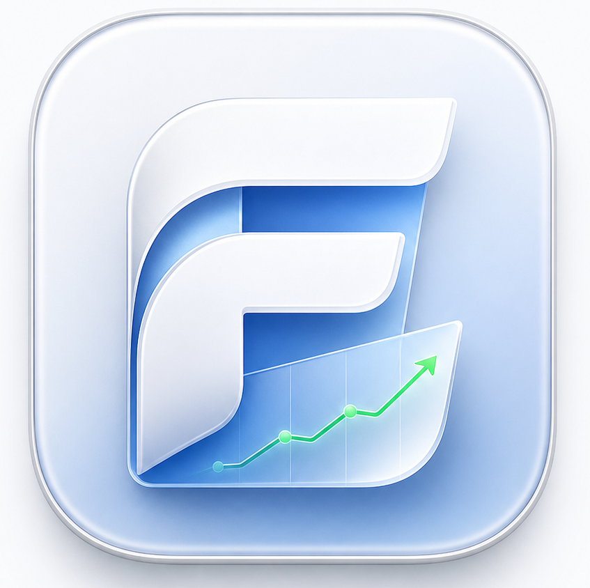
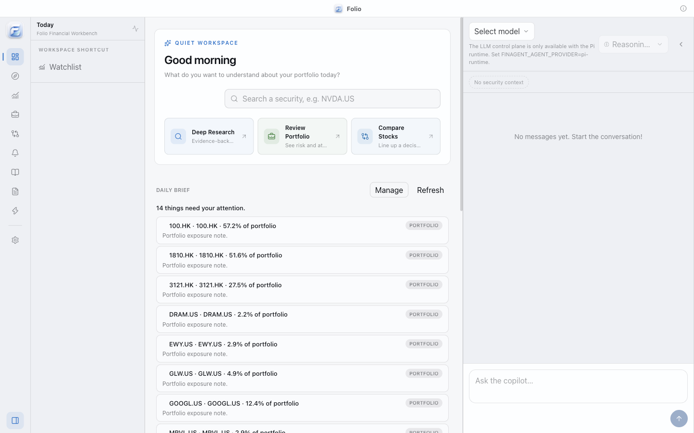
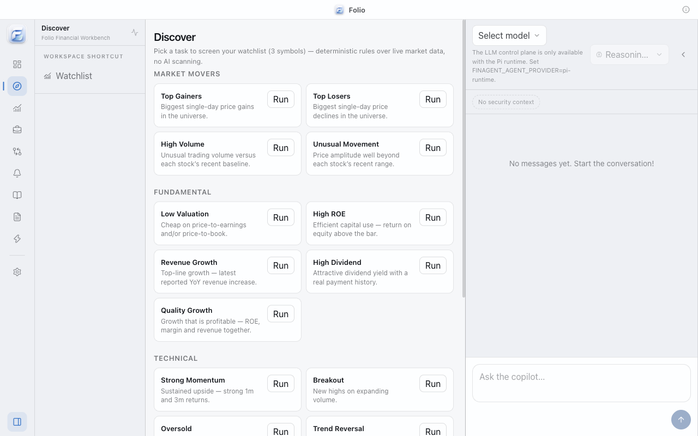
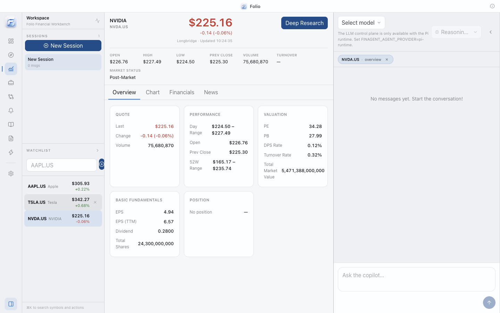

# Folio

<p align="center">
  
</p>

<p align="center">
  <strong>Local-first AI-native investment research workbench</strong><br />
  Research the market, understand your exposure, and keep an evidence-backed view of what changed.
</p>

<p align="center">
  <a href="https://github.com/helsome/folio/releases">Releases</a> ·
  <a href="docs/architecture.md">Architecture</a> ·
  <a href="docs/PRD.md">Product requirements</a>
</p>

> 一句话：行情终端告诉你 **What happened**；Folio 的 Agent 帮你回答 **Why does this matter to you**，记录 **What did you believe before**，并持续追踪 **What changed**。

## Our Product

Folio is a desktop research environment for public-market investors. It combines a quiet finance workspace with an agent copilot that can fetch structured market data, explain the evidence, and carry research forward into theses, alerts, and portfolio decisions.

Folio is local-first: sessions, credentials, and research state stay on the device by default. Market data and model providers are explicit integrations, not hidden dependencies.

> Folio is a research and decision-support tool. It is read-only by design and does not expose order or trading capabilities.

## Screenshots

<p align="center">
  
</p>

<p align="center">
  <em>Today — portfolio attention items, watchlist context, and quick research actions.</em>
</p>

<p align="center">
  
  
</p>

## Key Features

### Research Workspace

- Watchlists, quotes, K-line charts, financial statements, news, and security overviews.
- A three-pane desktop layout: navigation, market workspace, and Agent copilot.
- Compare 2–4 symbols across valuation, growth, margins, ROE, dividends, returns, ratings, and momentum.
- Data freshness is visible; missing values render as `—` instead of being guessed.

### Deep Research

- One-click research from a focused security.
- Parallel capability fetches with bounded concurrency, timeouts, cancellation, and honest partial-failure states.
- Structured data bundle → agent synthesis → evidence-backed `ResearchReport`.
- Reports contain stance, confidence, sections, bull case, bear case, catalysts, risks, and links back to the capability run behind each claim.

### Agent Copilot

- Persistent sessions and streamed answers powered by the Pi Agent runtime.
- Model and thinking-level controls, stop/cancel, workspace context, and structured quote/portfolio cards.
- Markdown answers render with headings, lists, tables, links, and code blocks.
- Internal synthesis sessions stay out of the visible conversation history.

### Skills & Capability Layer

- A single capability registry powers provider execution, agent tools, UI availability, and skill readiness.
- Skills declare required and optional capabilities; the Skills Center shows Ready, Partial, and Disabled states.
- Progressive loading keeps skill instructions and reference material available without putting every document into every prompt.
- The agent never claims a missing capability is available.

### Discover & Learning Loop

- 17 deterministic screening tasks across market movers, fundamentals, technicals, and events.
- Eight research strategies: Comprehensive, Value, Growth, Technical, Earnings, Event Driven, Risk Review, and Income.
- Candidate actions flow into Research, Compare, and Watchlist with evidence and reasons attached.
- Research Diff highlights changed verdicts, valuation moves, new risks, and confidence deltas.

### Portfolio, Thesis & Monitoring

- Portfolio allocation, concentration, Herfindahl, large-position, earnings, news, drawdown, and exposure signals.
- Save a report as an editable investment thesis and re-evaluate it against fresh data.
- Alert rules for price, news, earnings, ratings, dividends, position weight, and drawdown.
- Today combines portfolio attention items, watchlist movers, alerts, upcoming events, recent research, and theses needing review.

## How It Works

```text
Longbridge / Massive providers
              │
              ▼
     Capability Registry
              │
       ┌──────┼───────────────┐
       ▼      ▼               ▼
    Agent   Research       Product UI
    tools   + Thesis       + Skills
             + Alerts      + Compare
             + Risk        + Today
              │
              ▼
     Evidence-backed reports
```

The core boundary is deliberately small: providers return normalized data with provenance, capabilities expose typed operations, and product workflows consume those contracts instead of importing vendor-specific code.

## Flexible Integrations

- **Market data:** Longbridge is the primary connector for US/HK/CN market data and brokerage portfolio access; Massive is available as a secondary US market-data provider.
- **Agent runtime:** Pi runtime for configured LLM providers, with a deterministic local provider for development and offline golden paths.
- **Desktop:** Electron with a macOS arm64 packaged build. The renderer, preload bridge, and main-process kernel are separated by context isolation and a whitelisted IPC surface.
- **Skills:** Vendored `SKILL.md` resources with references, enable/disable state, triggers, and capability requirements.

## Quick Start

### For Users

Download the latest macOS build from the [Releases page](https://github.com/helsome/folio/releases). After launching Folio:

1. Configure an LLM provider in **Settings → Models**, or use the local provider for a deterministic demo.
2. Connect Longbridge in **Settings → Connections** if you want live market data and portfolio access.
3. Select a symbol from the Watchlist and open **Deep Research**.

Longbridge authentication can also be completed from the terminal:

```bash
longbridge auth login
```

### For Developers

Prerequisites: [Bun](https://bun.sh), the [Longbridge CLI](https://open.longbridge.com/longbridge/longbridge-terminal/install) for live data, and an LLM provider for the Pi runtime.

```bash
# Clone and install
git clone https://github.com/helsome/folio.git
cd folio
bun install

# Run the desktop app in development
bun run dev

# Deterministic local agent path — no external LLM required
FINAGENT_AGENT_PROVIDER=local bun run dev
```

### Commands

| Command | Description |
| --- | --- |
| `bun run dev` | Start the Electron renderer in development mode |
| `bun test` | Run the full unit and integration suite |
| `bun run typecheck` | Typecheck every workspace package |
| `bun run build` | Build packages, renderer, preload, and main process |
| `bun run test:e2e` | Run the Electron golden-path E2E suite |
| `bun run release:check` | Run the release gates |
| `bun run release:package` | Build the macOS arm64 app, DMG, and SHA256 checksums |

The packaged artifacts are staged in `dist/release/`.

## Security & Product Boundaries

- Electron runs with `contextIsolation: true`, `nodeIntegration: false`, and a whitelisted preload bridge.
- API keys and custom provider credentials are encrypted at rest with Electron `safeStorage` in the main process.
- Longbridge commands use argv-safe execution, symbol validation, and read-only capability registration.
- Skill resources are path-safe: traversal and symlink escapes are rejected.
- Research reports distinguish unavailable data from negative evidence and never fabricate missing numbers.
- Unsigned local builds may trigger a macOS security prompt; signing and notarization are opt-in release steps.

## Project Status

Folio is in beta. The current repository includes the V5 research, discovery, monitoring, outcome, and adaptive-calibration surfaces, plus the V6 quiet workspace visual system.

- Unit and integration tests: **912 passing**
- Typecheck: **green**
- Electron E2E and packaged smoke gates: available through the release scripts
- Current package channel: `0.4.0-beta.1`

Known limitations and release decisions are documented in [`docs/release-gates.md`](docs/release-gates.md) and [`docs/provider-b-decision.md`](docs/provider-b-decision.md).

## Roadmap

### Near Term

- More provider coverage behind the same capability contracts.
- Better report navigation and evidence inspection.
- More useful portfolio-aware research prompts without leaking internal runtime instructions into the user conversation.

### Longer Term

- Cross-platform packaged builds.
- More research strategies and outcome calibration samples.
- Richer scheduled briefs, notification channels, and user-defined monitoring rules.
- A contributor-friendly skill and provider extension model.

## Documentation

- [`docs/architecture.md`](docs/architecture.md) — system architecture and runtime boundaries
- [`docs/PRD.md`](docs/PRD.md) — product requirements and invariants
- [`docs/UI-SYSTEM.md`](docs/UI-SYSTEM.md) — visual system and component rules
- [`docs/longbridge-auth.md`](docs/longbridge-auth.md) — Longbridge authentication
- [`docs/longbridge-skill-setup.md`](docs/longbridge-skill-setup.md) — skill setup and capability coverage
- [`docs/release-gates.md`](docs/release-gates.md) — release validation checklist

## Contributing

Issues and pull requests are welcome. Before opening a change, run:

```bash
bun test
bun run typecheck
```

For UI changes, include a screenshot or a short visual QA note when the layout or interaction changes materially.
