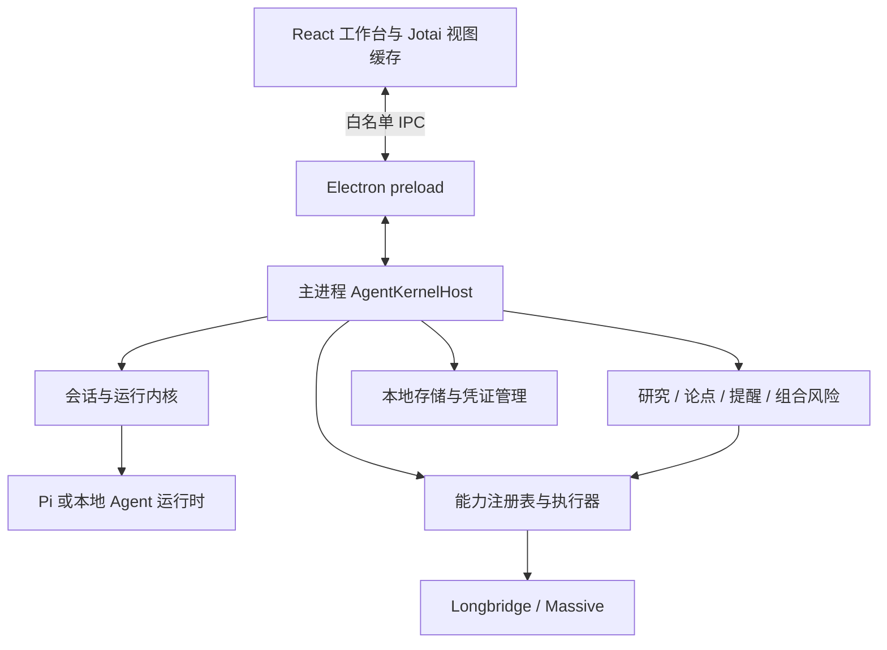
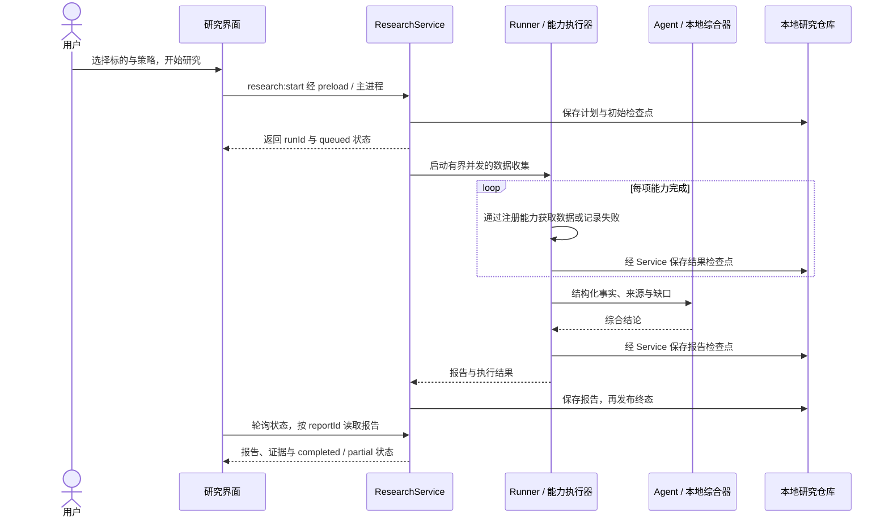

# Folio

<p align="center">
  
</p>

<p align="center">
  <a href="README.en.md">English</a> · <a href="README.md">简体中文</a>
</p>

<p align="center">
  <strong>本地优先的 AI 原生投资研究工作台</strong><br />
  研究市场、理解你的敞口，并持续保有基于证据的判断——清楚看到什么发生了变化。
</p>

<p align="center">
  <a href="https://github.com/helsome/folio/releases">发布版本</a> ·
  <a href="docs/architecture.zh-CN.md">系统架构</a> ·
  <a href="docs/PRD.md">产品需求</a>
</p>

> 一句话：行情终端告诉你 **What happened**；Folio 的 Agent 帮你回答 **Why does this matter to you**，记录 **What did you believe before**，并持续追踪 **What changed**。

[项目概览](#项目概览) · [运行截图](#运行截图) · [核心功能](#核心功能) · [工作原理](#工作原理) · [快速开始](#快速开始) · [项目结构](#项目结构) · [文档](#文档)

## 项目概览

Folio 是为公开市场投资者打造的桌面研究环境。它将安静整洁的金融工作区与 Agent 副驾驶（copilot）相结合——Agent 可以获取结构化的行情数据、解释证据，并将研究持续推进到投资论点、提醒与投资组合决策中。

Folio 本地优先：会话、凭证与研究状态默认保存在设备本地。使用在线模型、行情提供商或可选追踪服务时，相应请求仍会发往所配置的外部服务；本地优先不等于全程离线。

> Folio 是研究与决策支持工具，设计上只读，不提供下单或交易能力。

### 从哪里开始

| 你想做什么 | 从哪里进入 | 可以得到什么 |
| --- | --- | --- |
| 看今天值得关注什么 | Today / Events | 组合关注事项、自选异动、事件与研究入口 |
| 了解一家公司 | Workspace / Copilot | 行情、图表、财务、新闻，以及带工作区上下文的问答 |
| 建立有依据的判断 | Research / Compare | 带来源与缺口说明的研究报告、多个标的的对比 |
| 保留判断并持续复盘 | Thesis / Alerts | 可编辑论点、提醒规则、重新评估与研究差异 |
| 检查应用是否准备就绪 | Settings / Skills / Evaluation | 提供商连接、能力就绪状态、评测与追踪 |

**推荐上手路径：** 浏览 Today → 选择标的 → 打开研究工作区 → 运行深度研究 → 核对证据 → 保存为论点 → 用提醒与复评跟踪变化。

## 运行截图

以下图片来自仓库已有的 **真实 Electron 应用截图**：2026-08-28 通过 `e2e/visual.mjs` 在本地 Agent / 示例数据模式下捕获，见[来源提交](https://github.com/helsome/folio/commit/bc076da9a94d014076e02fd0a0dbcae3a3e01851)。它们展示当时的界面与状态，不代表实时行情、真实账户或当前版本的重新实测。完整[截图清单与说明](docs/screenshots/README.md)记录了每张图的状态。

### Today：先看今天需要关注什么


### 投资组合与事件：把信息放回自己的研究场景

| 投资组合 | 事件与催化 |
| --- | --- |
|  |  |
| 示例持仓、配置占比与研究入口 | 示例财报、宏观与央行事件，以及研究上下文入口 |

<details>
<summary>展开更多界面：工作区、发现、技能、设置、评测与健康检查</summary>

| 工作区 | 发现 |
| --- | --- |
|  |  |
| 未接入行情时如实显示缺失值 | 展示筛选入口，不代表已执行筛选 |

| 技能 | 设置 |
| --- | --- |
|  |  |

| 评测 | 本地工作区健康检查 |
| --- | --- |
|  |  |

</details>

示例数据会显示 `Sample data / 示例数据` 标记。工作区缺失数据、未配置服务和评测空态也如实保留；并非每个页面都有示例数据。

## 核心功能

### 研究工作区

- 自选清单、行情、K 线图、财务报表、新闻与证券概览。
- 三栏桌面布局：导航、市场工作区与 Agent 副驾驶；顶部常驻资产页签（K 线 / 报表 / 新闻 / 报告），任何页面都能一键切换视角。
- 在估值、成长性、利润率、ROE、股息、回报、评级与动量等维度对比 2–4 只标的。
- 数据新鲜度可见；缺失值显示为 `—`，不会凭空猜测。

### 开箱即用的示例数据（离线回退）

- 未接入行情提供商或 LLM 时，Today、组合总览、市场脉搏、事件与每日简报自动展示内置示例数据，应用从第一次启动起就是完整的。
- 所有示例内容都带有醒目的“示例数据”徽标（含接入指引 tooltip），错误信息保留在底层状态中，真实数据一旦可用立即覆盖示例。
- 不在示例集内的代码（如 `0700.HK`）保持诚实的空态/错误态，绝不编造数据。

### 深度研究

- 从聚焦的证券一键发起研究。
- 并行能力调用：有界并发、超时、取消与诚实的部分失败状态。
- 研究检查点保留已完成步骤；中断后可恢复、重新开始或丢弃。恢复需要原来的提供商、模型与配置，详见[研究恢复](docs/research-recovery.md)。
- 结构化数据包 → Agent 综合 → 基于证据的 `ResearchReport`。
- 报告包含立场、置信度、章节、看多论点、看空论点、催化剂、风险，以及每条论断背后对应能力执行记录的链接。

### Agent 副驾驶

- 由 Pi Agent 运行时驱动的持久会话与流式回答。
- 模型与思考级别控制、停止/取消、工作区上下文，以及结构化的行情/投资组合卡片。
- Markdown 回答支持标题、列表、表格、链接与代码块。
- 内部综合会话不会出现在可见的对话历史中。

### Agent 评测与可观测性

- 内置 Evaluation Center：查看实验、基线、模型对比、失败模式、案例详情与人工反馈。
- 评测覆盖任务完成、工具选择与参数、证据/来源、时延、失败恢复、研究完整性与决策可用性。
- 支持本地离线评测与可选 LangSmith / Langfuse 追踪；追踪默认关闭，隐私级别与 API 密钥在设置中单独管理。
- `folio-agent-v1` 基准集包含 86 个黄金路径、困难、长尾、工具失败、回归与对抗案例；固定 bug 会沉淀为回归门槛。
- 确定性的 fixture smoke eval 可手动运行；当前 `Eval Smoke` workflow 仅支持手动触发，不自动运行于 PR。完整 benchmark 与模型/策略实验另行运行。

### 技能与能力层

- 单一能力注册表驱动提供商执行、Agent 工具、UI 可用性与技能就绪状态。
- 技能声明所需与可选能力；技能中心展示就绪、部分就绪与已禁用状态。
- 渐进式加载让技能指令与参考资料随时可用，而无需把每份文档都塞进每个提示词。
- Agent 绝不会声称某个缺失的能力可用。

### 发现与学习循环

- 覆盖市场异动、基本面、技术面与事件的 17 个确定性筛选任务。
- 八种研究策略：综合、价值、成长、技术、财报、事件驱动、风险复盘与收益。
- 候选操作连同证据与理由流入研究、对比与自选清单。
- 研究差异对比（Research Diff）突出显示结论变化、估值变动、新风险与置信度变化。

### 投资组合、论点与监控

- 投资组合配置、集中度、赫芬达尔指数、大额持仓、财报、新闻、回撤与敞口信号。
- 将报告保存为可编辑的投资论点，并基于新数据重新评估。
- 针对价格、新闻、财报、评级、股息、持仓权重与回撤的提醒规则。
- Today 整合投资组合关注事项、自选异动、提醒、即将到来的事件、近期研究与待复审的论点。
- 独立的 **Events & Catalysts 页面**：财报、宏观数据与央行日历，一键带上下文跳转研究。
- **个人资料页**：本地工作区健康检查（AI / 行情 / 技能 / Agent 运行时）一目了然。

## 工作原理

### 整体架构


```mermaid
flowchart TD
    UI[React 工作台与 Jotai 视图缓存] <-->|白名单 IPC| Bridge[Electron preload]
    Bridge <--> Host[主进程 AgentKernelHost]
    Host --> Kernel[会话与运行内核]
    Kernel --> Runtime[Pi 或本地 Agent 运行时]
    Host --> Workflows[研究 / 论点 / 提醒 / 组合风险]
    Host --> Registry[能力注册表与执行器]
    Workflows --> Registry
    Registry --> Providers[Longbridge / Massive]
    Host --> Store[本地存储与凭证管理]
```

渲染进程负责交互与显示；主进程拥有会话、研究状态、凭证和外部访问。提供商返回带来源的规范化数据，产品工作流消费类型化能力契约。详见[系统架构](docs/architecture.zh-CN.md)。

### 一次深度研究如何完成


```mermaid
sequenceDiagram
    actor User as 用户
    participant UI as 研究界面
    participant Service as ResearchService
    participant Runner as Runner / 能力执行器
    participant Synth as Agent / 本地综合器
    participant Store as 本地研究仓库
    User->>UI: 选择标的与策略，开始研究
    UI->>Service: research:start 经 preload / 主进程
    Service->>Store: 保存计划与初始检查点
    Service-->>UI: 返回 runId 与 queued 状态
    Service->>Runner: 启动有界并发的数据收集
    loop 每项能力完成
        Runner->>Runner: 通过注册能力获取数据或记录失败
        Runner->>Store: 经 Service 保存结果检查点
    end
    Runner->>Synth: 结构化事实、来源与缺口
    Synth-->>Runner: 综合结论
    Runner->>Store: 经 Service 保存报告检查点
    Runner-->>Service: 报告与执行结果
    Service->>Store: 保存报告，再发布终态
    UI->>Service: 轮询状态，按 reportId 读取报告
    Service-->>UI: 报告、证据与 completed / partial 状态
```

这是成功产出报告的简化路径。缺失或失败的能力会保留在报告中；取消、失败与中断具有独立状态。中断恢复会复用已保存结果，避免重复已完成的抓取。实现入口：[Service](packages/shared/src/research/service.ts)、[Runner](packages/shared/src/research/runner.ts)、[UI 状态](packages/ui/src/atoms/researchAtoms.ts)。

## 灵活集成

- **行情数据：** Longbridge 是美股/港股/内地市场数据与券商投资组合访问的主要连接器；Massive 是美股市场的备选数据提供商。
- **Agent 运行时：** 为已配置的 LLM 提供商提供 Pi 运行时，另有用于开发与离线黄金路径的确定性本地提供商。
- **桌面端：** Electron，含 macOS arm64 打包构建。渲染进程、预加载桥与主进程内核通过上下文隔离与白名单化 IPC 接口面分离。
- **技能：** 内置 `SKILL.md` 资源，含引用、启用/禁用状态、触发器与能力要求。
- **Agent 评测：** 通过本地 Evaluation Backend、LangSmith 或 Langfuse 记录 trace、dataset、evaluator、experiment 与 regression gate；工程指标与投资结果保持可链接但不宣称因果关系。

## 快速开始

### 面向用户

从[发布页面](https://github.com/helsome/folio/releases)下载最新的 macOS 构建。启动 Folio 后：

1. 首次启动即可浏览完整工作台——未接入服务前展示内置示例数据（带“示例数据”徽标）。
2. 在 **设置 → 模型** 中配置 LLM 提供商，或使用本地提供商进行确定性演示。
3. 如需实时行情数据与投资组合访问，在 **设置 → 连接** 中连接 Longbridge；连接后示例数据自动切换为真实数据。
4. 从自选清单中选择标的，打开**深度研究**。

Longbridge 认证也可以在终端完成：

```bash
longbridge auth login
```

### 面向开发者

前置条件：[Bun](https://bun.sh)（PR CI 固定为 `1.4.2`）和 Git。真实行情需要单独安装并认证 [Longbridge CLI](https://open.longbridge.com/longbridge/longbridge-terminal/install)；Pi 运行时需要配置 LLM 提供商。本地演示不需要外部 LLM。

> **Windows**：建议在普通（非管理员）开发终端下先开启「开发人员模式」（设置 → 系统 → 开发者选项）。否则本项目使用 Bun 安装 workspace/symlink 依赖时可能出现 `node_modules` 空目录、缺少 `.bin`、`tsc not found` 等问题；具有相应符号链接权限或以提升权限运行的进程不受此限制。

```bash
# 克隆并安装
git clone https://github.com/helsome/folio.git
cd folio
bun install

# 构建渲染进程、preload 与主进程
bun run build

# 终端 1：启动渲染进程开发服务器（保持运行）
bun run dev
```

在第二个终端，从仓库根目录启动 Electron：

```bash
# 本地 Agent + 示例数据回退；Copilot 的示例回答带 Sample data 标记
FINAGENT_AGENT_PROVIDER=local FINAGENT_DEMO_DATA=1 bun --cwd apps/electron x electron .
```

`bun run dev` 只启动 Vite，不会独自打开 Electron 窗口；直接打开浏览器也没有主进程 IPC。环境变量要设在 Electron 进程上。需要在线模型时，先退出本地演示，去掉上面的两个演示变量重新启动 Electron，再到设置中配置模型；本地 Agent 模式不提供模型配置接口。主进程或 preload 改动后需重新构建并重启 Electron。上述环境变量语法适用于 POSIX shell；PowerShell 请使用 `$env:变量名="值"`。

### 命令

| 命令 | 说明 |
| --- | --- |
| `bun run dev` | 以开发模式启动 Electron 渲染进程 |
| `bun run test:unit` | 以隔离模式运行完整单元与集成测试套件 |
| `bun run typecheck` | 对所有工作区包执行类型检查 |
| `bun run build` | 构建包、渲染进程、预加载与主进程 |
| `bun run test:e2e` | 运行 Electron 黄金路径 E2E 套件 |
| `bun run --cwd apps/electron test:typed-blocks` | 运行 typed answer blocks 的真实应用 Copilot E2E（apps/electron） |
| `bun run eval:smoke` | 手动运行确定性 Agent smoke 评测 |
| `bun run eval:full` | 运行完整 Agent benchmark 与实验流程 |
| `bun run release:check` | 运行发布门槛检查 |
| `bun run release:package` | 构建 macOS arm64 应用、DMG 与 SHA256 校验和 |

打包产物暂存于 `dist/release/`。

## 安全与产品边界

- Electron 以 `contextIsolation: true`、`nodeIntegration: false` 运行，并采用白名单化预加载桥。
- API 密钥与自定义提供商凭证在主进程中使用 Electron `safeStorage` 加密存储。
- Longbridge 命令使用 argv 安全执行、标的校验与只读能力注册。
- 技能资源路径安全：拒绝路径穿越与符号链接逃逸。
- 研究报告区分“数据不可用”与“负面证据”，绝不编造缺失的数字。
- Agent 追踪默认关闭；标准隐私级别会脱敏 prompt、答案、参数与组合工具结果，完整追踪必须显式启用。
- 未签名的本地构建可能触发 macOS 安全提示；签名与公证要求见[发布门槛](docs/release-gates.zh-CN.md)。

## 项目状态

Folio 处于测试版（beta）。当前仓库包含 V5 研究、发现、监控、结果与自适应校准相关功能面，以及落地 Stitch「Minimalist Personal Portfolio」设计语言的全新视觉系统：重绘的侧栏与顶部工作区栏、Events & Catalysts 与个人资料页面、统一的组件库与圆角阶梯，以及离线示例数据回退。

Agent 工程评测已接入设置与评测中心：支持 LangSmith / Langfuse 连接、隐私控制、基准实验、失败模式分析、案例级 trace 与人工反馈；研究执行支持持久检查点与中断恢复。

- 检查命令与门槛见上表；实际结果以对应提交的测试报告与 [Actions](https://github.com/helsome/folio/actions) 为准
- PR 检查对纯 Markdown / `docs/**` / `artifacts/**` 改动跳过；没有检查记录不等于测试通过
- Electron E2E 与打包冒烟门槛：可通过发布脚本运行
- 当前包通道：`0.4.0-beta.2`

已知限制与发布决策记录在 [`docs/release-gates.zh-CN.md`](docs/release-gates.zh-CN.md)（[英文原文](docs/release-gates.md)）与 [`docs/provider-b-decision.zh-CN.md`](docs/provider-b-decision.zh-CN.md)（[英文原文](docs/provider-b-decision.md)）。

## 路线图

### 近期

- 在同一能力契约下覆盖更多提供商。
- 更好的报告导航与证据检视。
- 证券工作台的估值对比表（CURRENT vs 5Y AVG）与目标价卡片（见 [`docs/design-comparison.md`](docs/design-comparison.md)）。
- 更有用的组合感知研究提示，同时不把内部运行时指令泄漏进用户对话。

### 长期

- 跨平台打包构建。
- 更多研究策略与结果校准样本。
- 更丰富的定时简报、通知渠道与用户自定义监控规则。
- 便于贡献者使用的技能与提供商扩展模型。

## 项目结构

| 目录 | 职责 |
| --- | --- |
| [`apps/electron`](apps/electron) | Electron 主进程、IPC、preload、渲染入口与 E2E |
| [`packages/ui`](packages/ui) | React 页面、组件、Jotai 状态与示例数据 |
| [`packages/core`](packages/core) | 能力、研究、组合、事件与追踪等领域契约 |
| [`packages/shared`](packages/shared) | Agent 内核、提供商、研究工作流与本地存储 |
| [`packages/longbridge-tools`](packages/longbridge-tools) | Longbridge CLI 执行、校验与结果适配 |
| [`packages/pi-extension`](packages/pi-extension) / [`.pi/extensions`](.pi/extensions) | Agent 工具与 Pi 运行时扩展 |
| [`packages/skill-hub`](packages/skill-hub) / [`skills`](skills) | 技能发现、能力要求与内置技能资源 |
| [`packages/i18n`](packages/i18n) | 中英文界面与本地化资源 |
| [`scripts/eval`](scripts/eval) / [`docs`](docs) | 评测入口、验证说明与设计文档 |

## 文档

- [`docs/architecture.zh-CN.md`](docs/architecture.zh-CN.md) — 系统架构与运行时边界 · [English](docs/architecture.md)
- [`docs/PRD.md`](docs/PRD.md) — 产品需求与不变式（本文档为中文）
- [`docs/UI-SYSTEM.zh-CN.md`](docs/UI-SYSTEM.zh-CN.md) — 视觉系统与组件规则 · [English](docs/UI-SYSTEM.md)
- [`docs/longbridge-auth.zh-CN.md`](docs/longbridge-auth.zh-CN.md) — Longbridge 认证 · [English](docs/longbridge-auth.md)
- [`docs/longbridge-skill-setup.zh-CN.md`](docs/longbridge-skill-setup.zh-CN.md) — 技能安装与能力覆盖 · [English](docs/longbridge-skill-setup.md)
- [`docs/release-gates.zh-CN.md`](docs/release-gates.zh-CN.md) — 发布验证清单 · [English](docs/release-gates.md)
- [`docs/EVALUATION.md`](docs/EVALUATION.md) — Agent 评测、LangSmith 可观测性与实验架构 · [CI 策略](docs/EVALUATION-CI.md) · [基准集](docs/EVALUATION-BENCHMARK.md)
- [`docs/research-recovery.md`](docs/research-recovery.md) — 研究检查点、中断恢复与验证说明
- [`docs/langfuse-tracing.zh-CN.md`](docs/langfuse-tracing.zh-CN.md) — Copilot / 深度研究的 Langfuse 追踪 · [English](docs/langfuse-tracing.md)
- [`docs/screenshots/README.md`](docs/screenshots/README.md) — 运行截图来源、日期与数据状态
- [`docs/design-comparison.md`](docs/design-comparison.md) — Stitch 设计稿与当前实现的逐屏对比

## 参与贡献

欢迎提交 Issue 与 Pull Request。先阅读[贡献指南](CONTRIBUTING.md)，提交前运行与改动相关的检查，并提供环境、实际命令、结果与已知限制。完整检查入口：

```bash
bun test
bun run typecheck
```

有可见 UI 变化时附上修改后截图，适用时提供前后对比；无可见 UI 变化时在 PR 中注明。
