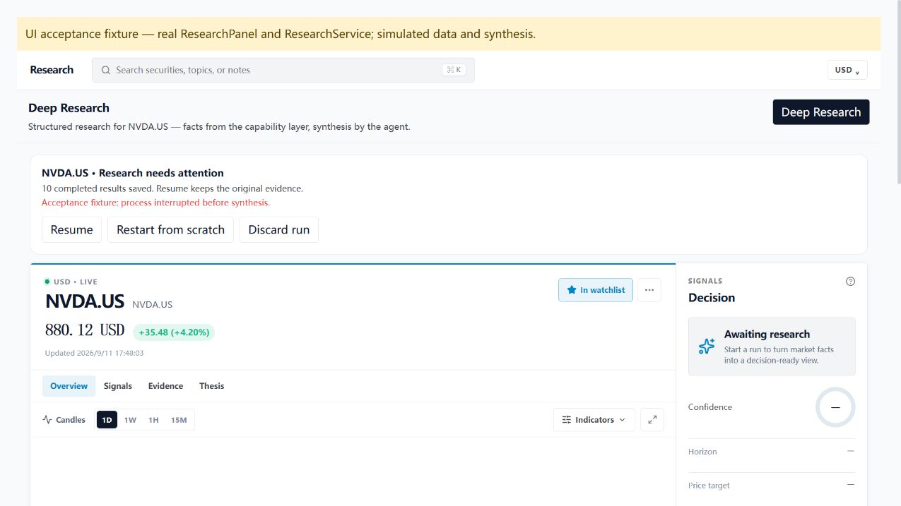
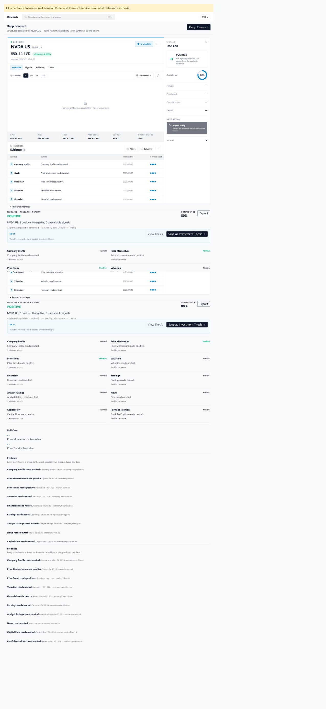

# Research recovery acceptance report

## Latest rebase validation (2026-09-11, after #81)

Rebased onto `6a9a288`, which includes #81. Git applied the existing research change without conflicts; `git range-diff` confirmed the implementation patch was unchanged from the previously approved `442d08a`. The #73 blocked report-write regression remains unchanged, and report persistence still precedes terminal checkpoint/summary publication.

- Focused command below: **116 pass / 0 fail**, 414 assertions, 18 files.
- `bun node_modules/typescript/bin/tsc --noEmit`: **exit 0**.
- `git diff origin/main...HEAD --check`: **exit 0**.
- Per review, no repeat of live hard-kill / DeepSeek / Longbridge acceptance.

## Earlier rebase validation (2026-09-11)

Rebased onto `f9309ac` (latest main at validation), including #73's report-before-terminal fix. Its deterministic blocked `saveReport()` regression remains unchanged. The recovery service saves the report and derived records before committing its terminal checkpoint/summary. The new main's `onRunComplete` telemetry hook receives the committed terminal result afterward; a focused regression verifies that telemetry failure cannot interrupt the persisted result. Configuration identity now reads the persisted routing introduced by main.

- `bun test --isolate packages/shared/src/research packages/ui/src/components/research packages/pi-extension/src --timeout 20000`: **116 pass / 0 fail**, 414 assertions, 18 files.
- `bun node_modules/typescript/bin/tsc --noEmit`: **exit 0**.
- The live fault-injection artifacts below are from the original acceptance run; that run was not repeated after rebase, as requested in review.

## Original acceptance environment

Date: 2026-09-11. Environment: Windows NT 10.0.26200.0, Bun 1.4.2, Node 25.9.0.
Baseline: ca52f6b3bd50c463afe3973c7d170c3cc6d68d59 (unmodified main checkout with the same installed dependencies).

## Live kernel fault injection — PASS

Actual command, from repository root, after loading the local DeepSeek key into the process environment:

```powershell
$env:FINAGENT_RECOVERY_OUTPUT = '<absolute path to a fresh output directory>'
$env:FINAGENT_RECOVERY_NEWS_RELAY = '1'
bun apps/electron/e2e/research-recovery-kernel.ts
```

The live relay read the generated request id, called the authorized Longbridge MCP `news` tool for NVDA.US, then wrote the matching response and fetch timestamp within the capability timeout. It retrieved 43 articles; the capability persisted the first 10. No account/portfolio endpoint was used.

The separate process hosted the actual AgentKernel and ResearchService. An injected HTTP AgentRuntime streamed a real DeepSeek response (`deepseek-chat`, resolved by the API to `deepseek-flash`). This validates the kernel/workflow persistence path; it does not run the desktop Pi adapter or Electron IPC.

| Evidence | Observed result |
| --- | --- |
| Kill point | First real model stream delta after news was durably checkpointed, before synthesis was saved |
| Hard-killed PID | 29600 |
| Original and recovered research id | research-1de3f102-13b4-4261-810e-93e5bff7abde |
| Kernel run before kill | 2f91d332-859d-439f-8461-7fcff8aba38a |
| Kernel run after restart | 71b0bc03-8f18-4425-b08d-44e4b6e0da9c |
| Startup state | interrupted, recoverable |
| Recovery count | 1 |
| News attempts | 1; completed outcomes were byte-for-byte equivalent after recovery |
| Synthesis attempts | 2; the interrupted attempt stayed charged |
| Reports / evidence refs / section keys | 1 / 1 / 10, without duplicates |
| Saved news sources | 10 distinct URLs; unchanged after recovery (post-run artifact comparison) |
| Final status | partial: news succeeded; other nine capabilities explicitly unavailable |
| Completed model request usage | 1976 prompt + 1623 completion = 3599 tokens; excludes the killed request |

Committed artifacts:

- [Before checkpoint](acceptance/research-recovery/before-checkpoint.json)
- [After checkpoint](acceptance/research-recovery/after-checkpoint.json)
- [Final model-generated report](acceptance/research-recovery/final-report.json)
- [Verification record](acceptance/research-recovery/verification.json)
- [Provider-reported final request usage](acceptance/research-recovery/model-usage-resume.json)

Checkpoints are decoded payloads for review, not secret-bearing runtime configuration. They contain public news, ids and recovery accounting. The generated report is test output, not independently verified financial analysis.

## Automated checks

| Executed command | Result |
| --- | --- |
| `bun test --isolate packages/shared/src/research packages/ui/src/components/research packages/pi-extension/src --timeout 20000` | 114 pass / 0 fail; 404 assertions across 18 files |
| `bun test --isolate` | 1203 pass / 7 skip / 27 fail; 1237 tests across 141 files |
| Same full command in unmodified baseline | 1186 pass / 7 skip / 27 fail / 1 unhandled error; 1220 tests across 137 files |
| `bun node_modules/typescript/bin/tsc --noEmit` | exit 0 |
| Direct TypeScript `--noEmit` in core, i18n, shared, ui and electron workspaces | all exit 0 |
| `bun scripts/i18n-check.ts` | 1433 keys per locale, 0 parity issues |
| `git diff --check` | exit 0 |

The 27 failing names are identical after removing timing suffixes and comparing unique test names. They comprise Windows path expectations (3), symlink privilege (1), experiment trace expectation (1), Longbridge mocked child-process/platform behavior (20), and locale/date formatting (2). The baseline additionally had an old research-service write-after-test-cleanup error; the modified suite did not.

The root `bun run typecheck` workspace launcher could not spawn processes in this sandbox. The equivalent actual TypeScript commands were executed directly in every workspace.

Core coverage includes real OS SIGKILL with deterministic providers, saved-evidence reuse, duplicate resume, publication replay, missing/corrupt projections, checksum/schema/version rejection, preserved corrupt originals, legacy state, changed identity, cancellation, budget persistence, write-capability rejection, disk-outage diagnostics, and synthesis tool blocking.

## Builds and UI evidence

Executed build commands:

```sh
bun build apps/electron/src/main/index.ts --outfile apps/electron/src/main/index.js --bundle --target node --format esm --external electron
bun build apps/electron/src/preload/index.ts --outfile apps/electron/src/preload/index.cjs --target node --format cjs --external electron
```

Both succeeded. Generated preload is included. Renderer build also succeeded using Vite 8's native config loader. A work-directory-only helper treated Vite's optional `net use` subprocess probe as unavailable because Windows sandbox process creation rejects it. No production Vite configuration was changed. This is not a successful packaging test.

These screenshots show the actual ResearchPanel in a localhost browser, backed by the real ResearchService with explicitly labeled fixture capabilities/local synthesis. Clicking Resume produced a report, and page reload rehydrated it. They demonstrate the recovery UI; the separate kernel artifacts above demonstrate real model/retrieval behavior.





## Limits

The Electron/Pi desktop harness is provided at `apps/electron/e2e/research-recovery.mjs`, but has not passed here. Electron fails before UI initialization at Mojo IPC channel creation, with access denied (0x5); piped child-process creation also returns EPERM. No sandbox protection was disabled.

Longbridge MCP quote/news calls succeeded. Longbridge CLI 0.28.5 was installed and checksum-verified, and its updater confirmed the version is current, but its default credential directory could not be created in this sandbox. The official Longbridge Skill was installed in the work directory and read. The DeepSeek key passed authentication, available-balance and real completion checks; no key or authorization code is committed.

Pi CLI 0.73.1 was also installed outside the repository and configured with a custom DeepSeek provider using an environment-variable API key. Its direct `--provider deepseek --model deepseek-chat --no-session --no-extensions --no-skills --no-prompt-templates --mode text --print 'Reply with exactly OK. Do not use any tools.'` smoke test returned `OK`, exit 0. This verifies the Pi provider configuration, but does not claim validation of Folio's piped Pi RPC or extension integration.
